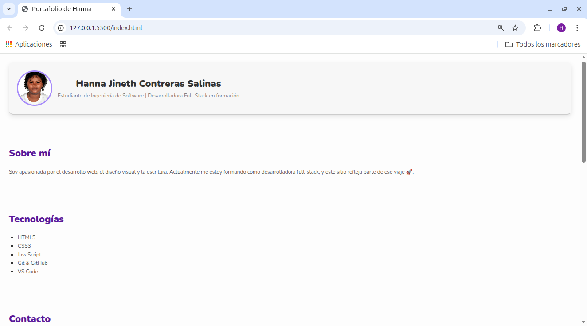

# 🌐 Portafolio Web – Hanna Jineth Contreras Salinas

¡Hola! 👋 Soy **Hanna Jineth Contreras Salinas**, estudiante de tercer semestre de Ingeniería de Software y Datos, futura desarrolladora full-stack y apasionada por el diseño, la escritura y la tecnología.  
Este es mi portafolio personal donde comparto quién soy, qué he aprendido y los proyectos que estoy construyendo con dedicación.

---

## ✨ Sobre mí

- 🎓 Estudiante de Ingeniería de Software y Datos – IU Digital de Antioquia  
- 💻 Apasionada por el desarrollo web, el diseño UI/UX, el marketing digital y la escritura creativa  
- 🚀 En formación constante con cursos de Google, Stanford, freeCodeCamp y más  
- 🌍 Ubicación: Chigorodó, Colombia (trabajo remoto)  
- 📚 Autora de poemarios y relatos publicados

---

## ⚙️ Tecnologías usadas

- **Lenguajes & Herramientas**: HTML5, CSS3, Git, GitHub, VS Code  
- **Web**: GitHub Pages, diseño responsive, Markdown, SEO básico  
- **Otros**: Canva, Trello, ChatGPT, Google Docs, VirtualBox  
- **Sistemas operativos**: Windows, Linux (básico)

---

## 🖼️ Vista previa



🟣 **Accede a la web en vivo**: [🔗 hannasalinas.github.io/portafolio-hanna](https://hannasalinas.github.io/portafolio-hanna)

---

## 📂 Estructura del proyecto

```
portafolio-hanna/
├── index.html
├── styles.css
├── script.js
├── textos/
├── imágenes/
├── Hoja de vida.pdf
├── README.md
└── .gitignore

---

## 🚀 Cómo ejecutarlo localmente

1. Clona este repositorio:
```bash
git clone https://github.com/HannaSalinas/portafolio-hanna.git
```


---

##  🛠️ Estado del proyecto
✅ Sitio funcional publicado en GitHub Pages
🛠️ En mejora continua:

Agregando certificados

Incluyendo más proyectos y escritos

Mejorando diseño y estructura de código

## 📬 Contacto
📧 Email: salinashanna123@gmail.com

🐙 GitHub: @HannaSalinas

💼 LinkedIn: hannacontreras

## 📄 Licencia
Este proyecto es de uso personal con fines educativos y profesionales.
Puedes usarlo como inspiración con atribución. ❤️

“Creo que la tecnología también puede ser poesía.” – Hanna